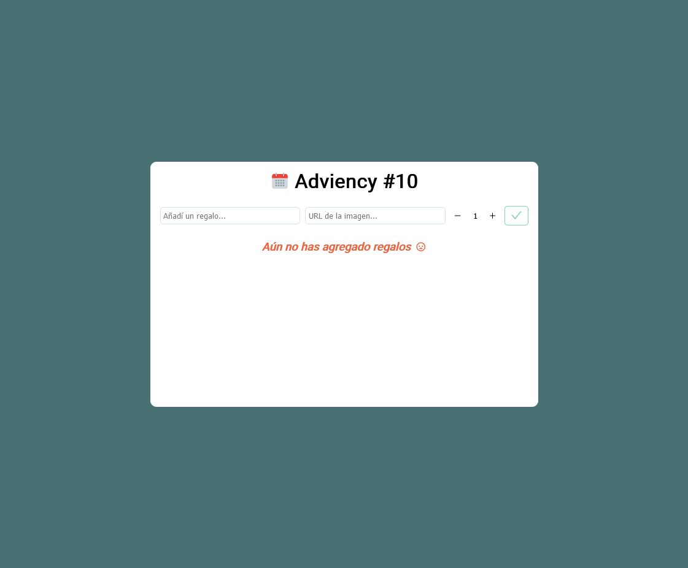
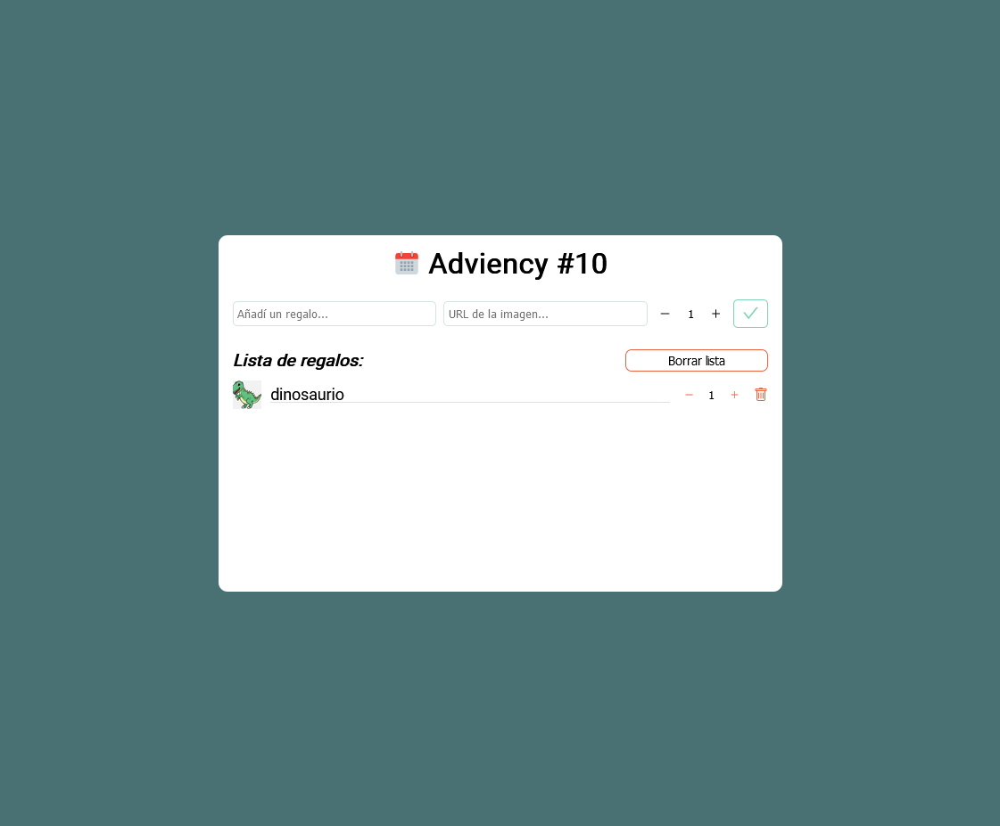
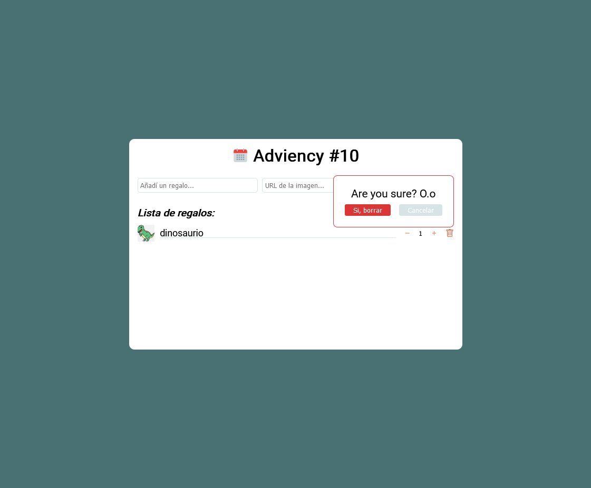

## Desarrollo de los dias 5 al 10 del reto **_#Adviency_**

## [**Implementando en esta versión:**](https://lista-de-regalos-adviency-10.vercel.app/)

- Input para agregar una URL de la imagen del regalo.
- Controles para evitar que se ingresen elementos sin título.
- Contador para seleccionar la cantidad de ese regalo.
- Editor para cambiar la cantidad del regalo una vez añadido.
- Buscador: a medida que el usuario va escribiendo se le muestran las coincidencias para ayudarlo por si no recuerda si ya había agregado el regalo.
- Boton para eliminar todos los regalos, con una modal por si se pulsó por accidente.
- Ordenamiento alfabético de los regalos.
- Animaciones.

### [Versión previa](https://github.com/dbdv/adviency_3_4):

- **Redux**
- Persistencia de datos
- Estructura orientada para el uso de una **API** (que crearé más adelante)
